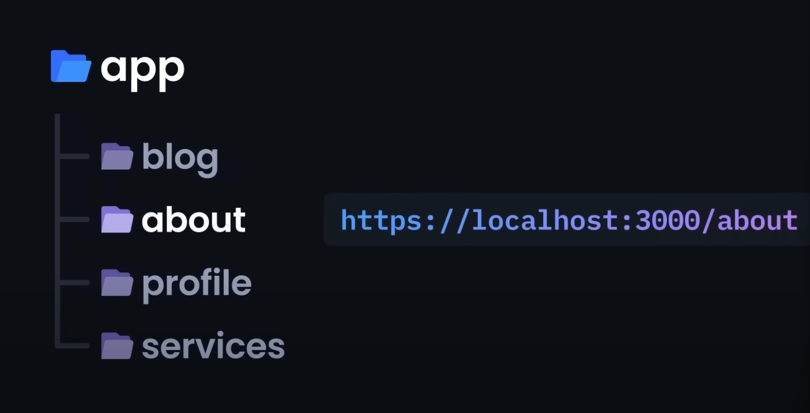

This is a [Next.js](https://nextjs.org/) project bootstrapped with [`create-next-app`](https://github.com/vercel/next.js/tree/canary/packages/create-next-app).

## Getting Started

First, run the development server:

```bash
npm run dev
# or
yarn dev
# or
pnpm dev
```

Open [http://localhost:3000](http://localhost:3000) with your browser to see the result.

You can start editing the page by modifying `app/page.tsx`. The page auto-updates as you edit the file.

This project uses [`next/font`](https://nextjs.org/docs/basic-features/font-optimization) to automatically optimize and load Inter, a custom Google Font.

## Learn More

To learn more about Next.js, take a look at the following resources:

- [Next.js Documentation](https://nextjs.org/docs) - learn about Next.js features and API.
- [Learn Next.js](https://nextjs.org/learn) - an interactive Next.js tutorial.

You can check out [the Next.js GitHub repository](https://github.com/vercel/next.js/) - your feedback and contributions are welcome!

## Deploy on Vercel

The easiest way to deploy your Next.js app is to use the [Vercel Platform](https://vercel.com/new?utm_medium=default-template&filter=next.js&utm_source=create-next-app&utm_campaign=create-next-app-readme) from the creators of Next.js.

Check out our [Next.js deployment documentation](https://nextjs.org/docs/deployment) for more details.

# Next.js Simplified

This repository is a simplified crash course on Next.js. It is meant to be a quick reference for developers who are already familiar with React and want to learn Next.js.

<details>
  <summary>Why Next.js?</summary></br>

  `Next.js` is a framework built on top of `React` that allows for server-side rendering, static site generation, and more. It is a great tool for building websites and web applications that require SEO, fast load times, and a great developer experience.

  It's used by major companies like _Netflix_, _Tiktok_, and more.

  The major question to ask is what does `Next.js` offer that `React` doesn't?

  1. Server-side rendering (SSR)
  2. Routing
  3. Fullstack Applications
  4. Automatic Code Splitting


  ## Server-side rendering (SSR)

  You may already be aware that `React` is a client-side framework. What this means is that `React` renders user interfaces on the client-side, or in the browser. This is great for building single-page applications (SPAs) but not so great for SEO.

  When a user visits a website, the browser makes a request to the server and the server responds with an HTML file. This HTML file is then parsed by the browser and rendered to the user. The problem with SPAs is that the server responds with an empty HTML file and the browser has to wait for the JavaScript to load before it can render the page. This is bad for SEO because search engines like Google don't wait for JavaScript to load before indexing a page.

  `Next.js` is amazing because it allows you to render your application on the server-side. This means that when a user visits your website, the server responds with a fully rendered HTML file. This is great for SEO because search engines like Google can index your page without having to wait for JavaScript to load.

  ## Routing

  Another annoying thing with `React` is that it doesn't come with a built-in router. This means that if you want to create a multi-page application, you have to use a third-party library like `react-router-dom`. This is not the case with `Next.js`. `Next.js` comes with a built-in router that uses file-based routing and allows you to create multi-page applications with ease.

  It all starts with the `app` directory. Any folder created within the `app` directory will become a new route whose page content is determined by the `page.tsx` file within the folder.

  

  ## Fullstack Applications

  `Next.js` is a fullstack framework. This means that you can build both the frontend and backend of your application within `Next.js`. This is great because it allows you to build your entire application with one framework. This means that you don't have to worry about integrating a backend framework like `Express` or `Django` with your frontend framework.

  `Next.js` has a feature called `API Routes`. These are serverless functions that can handle API requests, or creating API endpoints. No need for an additional server.

  All you have to do is create a folder called `api` in the `app` directory, create the path of your api, and create a `route.ts` file within the folder. For example, if you want to access your users api at `/api/users`, you would create a folder called `users` within the `api` directory and create a `route.ts` file within the folder.

  ## Automatic Code Splitting

  The final thing that `Next.js` offers that `React` doesn't is automatic code splitting. This means that `Next.js` will automatically split your code into smaller chunks and only load the code that is needed for the current page. This is great for performance because it means that your users will only have to download the code that they need for the current page.

  While possible in `React` with things like `lazy` and `Suspense`, it's entirely automatic in `Next.js`.
</details>

<details>
  <summary>Getting Started</summary></br>

  To get started with creating a `Next.js` project, you can run the following command:

  ```bash
  npx create-next-app@latest
  ```

  With the surge of `TypeScript`, it's likely you'll utilize it and `Tailwind CSS` in your `Next.js` projects. The following dependencies are highly recommended:

  ```bash
  npm i -D @total-typescript/ts-reset prettier-plugin-tailwindcss
  ```
  
  Both dev dependencies, the first is a `TypeScript` reset that fixes many inference issues and the second is a `Prettier` plugin that allows for the sorting of `Tailwind CSS` classes.

  To utilize the `TypeScript` reset, create a `reset.d.ts` file in the root of your project and add the following:

  ```ts
  import '@total-typescript/ts-reset';
  ```

  More information can be found [here](https://github.com/total-typescript/ts-reset)
</details>

<details>
  <summary>File and Folder Structure</summary></br>

  In the newest version of `Next.js`, the pertinent folder is the `app` directory in the root of your project. This is where all of your `Next.js` application pages will live. It includes a `favicon.ico` file, a `globals.css` file, a `layout.tsx` file, and a `page.tsx` file.

  ## `layout.tsx`

  Let's start with the `layout.tsx` file.

  ```tsx
  import './globals.css';
  import { Inter } from 'next/font/google';

  const inter = Inter({ subsets: ['latin'] });

  export const metadata = {
    title: 'Create Next App',
    description: 'Generated by create next app',
  };

  export default function RootLayout({
    children,
  }: {
    children: React.ReactNode;
  }) {
    return (
      <html lang='en'>
        <body className={inter.className}>{children}</body>
      </html>
    );
  }
  ```

  The `layout.tsx` file is the root layout of your application. It is the layout shared by all of your pages. So, if we wanted to include a `navbar` or `footer` componeont on all of our pages, we would include it in the `layout.tsx` file.

  Another useful thing is the `metadata` object. This object contains the `title` and `description` of your application and is vital for SEO.

  ## `page.tsx`

  Next, let's look at the `page.tsx` file.

  ```tsx
  export default function Home() {
    return (
      <main>
        <h1>Hello World</h1>
      </main>
    );
  }
  ```

  The default `page.tsx` has a lot of content, but it's basically just the entry point of your application. It is the page that will render when you visit `http://localhost:3000/`.
</details>

<details>
  <summary>Reserved File Names</summary></br>

  As explained, `Next.js` handles routing with a file-based router. What this means is that it will automatically create routes based on reserved file names.

  The reserved file names are as follows:
  
  - `page.tsx`
  - `layout.tsx`
  - `loading.tsx`
  - `error.tsx`
  - `not-found.tsx`
  - `route.ts`

  The `page.tsx` file lets `Next.js` know that the folder is a route. For example, creating a `/app/profile/page.tsx` file will create a route at `/app/profile`. An `/app/profile/settings/page.tsx` file will create a route at `/app/profile/settings`.

  The `layout.tsx` file is like the one we saw earlier, but it can also be used in subdirectories or nested routes. By doing so, we can have a different shared layout for different pages. For more information, see the [Next.js documentation](https://nextjs.org/docs/app/api-reference/file-conventions/layout).

  The `loading.tsx` file is used to display a loading indicator while the page is loading. This is useful for pages that have a lot of content or pages that are fetching data from an API. For more information, see the [Next.js documentation](https://nextjs.org/docs/app/building-your-application/routing/loading-ui-and-streaming).

  This video is also a great resource for [Loading Skeletons](https://www.youtube.com/watch?v=7MKEOfSP2s4)

  The `error.tsx` file is used to display an error page when an error occurs. This is useful for pages that are fetching data from an API.

  ```tsx
  'use client' // Error components must be Client Components
 
  import { useEffect } from 'react'
  
  export default function Error({
    error,
    reset,
  }: {
    error: Error
    reset: () => void
  }) {
    useEffect(() => {
      // Log the error to an error reporting service
      console.error(error)
    }, [error])
  
    return (
      <div>
        <h2>Something went wrong!</h2>
        <button
          onClick={
            // Attempt to recover by trying to re-render the segment
            () => reset()
          }
        >
          Try again
        </button>
      </div>
    )
  }
  ```

  For more information, see the [Next.js documentation](https://nextjs.org/docs/app/api-reference/file-conventions/error).

  The `not-found.tsx` file is used to display a custom 404 page when a notFound() error is thrown from `next/navigation`. It also handles any unmatched URLs for the entire application. So, for example:

  ```tsx
  import { notFound } from 'next/navigation';

  if (!user) {
    notFound();
  }
  ```

  For more information, see the [Next.js documentation](https://nextjs.org/docs/app/api-reference/file-conventions/not-found).

  The final reserved file name is `route.ts`. It relates to serverless API routes, which we'll cover later.
</details>

<details>
  <summary>Server and Client Components</summary></br>

  As mentioned earlier, `Next.js` utilizes server-side rendering. What this means is that, by default, any `page.tsx` file or component within the `app` directory will be rendered on the server-side. This is great for SEO, but it's not always what you want.

  For example, if you want to utilize client-side libraries or, more commonly, React hooks like `useState` and `useEffect`, you'll need to render your component on the client-side. To do this, we need to add the `use client` directive at the top of the file, **_BEFORE any imports_**.

  ```tsx
  'use client';

  import { useState } from 'react';

  export default function Home() {
    const [count, setCount] = useState(0);

    return (
      <main>
        <h1>Hello World</h1>
        <p>Count: {count}</p>
        <button onClick={() => setCount(c => c + 1)}>Increment</button>
      </main>
    );
  }
  ```

  If you don't do this, you'll get a client side error that says something like `Hooks can only be called inside the body of a function component`. This is because `Next.js` is trying to render your component on the server-side, but hooks can only be called on the client-side.

  Often, it's best not to use the `use client` directive until you get an error, because then you know that you definitely need it. Server-side rendering is faster and better for SEO, so it should be used whenever possible. SSR is meant for UI pages that don't include component logic.
</details>

<details>
  <summary>Routing</summary></br>
  `Next.js` uses server-centric routing with client-side navigation. This means that, by default, it will render a page on the server-side, but it will use client-side navigation to navigate between pages. This is great for SEO.
  
  To navigate between routes, we can utilize one of two things:

  - The `Link` component
  - The `useRouter` hook

  ```tsx
  import Link from 'next/link'
 
  export default function Page({ post }) {
    return (
      <div>
        <Link href="/dashboard">Dashboard</Link>
        <Link href={`/blog/${post.slug}`}>{post.title}</Link>
      </div>
    )
  }
  ```

  ```tsx
  'use client'
 
  import { useRouter } from 'next/navigation'
  
  export default function Page() {
    const router = useRouter()
  
    return (
      <button type="button" onClick={() => router.push('/dashboard')}>
        Dashboard
      </button>
    )
  }
  ```

  As mentioned, we don't want to utilize client components unless we need to. So, if you're just navigating between pages, use the `Link` component. If you need to navigate programmatically, use the `useRouter` hook.

  Also, if you're using `useRouter` and want to prefetch the page, you can do so using `router.prefetch('/dashboard')`. This will prefetch the page in the background, so it's ready when the user clicks the link.

  But what about dynamic routing? Sticking with our example of posts, maybe we want to have a `posts/[postId]` page that shows a specific post. To do this, it's pretty simple.

  We create a `posts` folder in the `app` directory and then create a `[postId]` folder, along with the brackets, followed by a `page.tsx` file within that folder. By surrounding a folder name with brackets, we tell `Next.js` that this is a dynamic route.

  ```tsx
  export default function Post({ postId }: { params: { postId: string }}) {
    return (
      <main>
        <h1>Post {postId}</h1>
      </main>
    );
  }
  ```

  Notice that we have automatic access to that dynamic route parameter through props. We can use it in our component. Now, if you visit `http://localhost:3000/posts/1`, you'll see the `Post 1` page. If you visit `http://localhost:3000/posts/2`, you'll see the `Post 2` page. And so on.

  Finally, if you want to utilize the path of the current route, either the entire path, or the query parameters, you can do so using the `usePathname()` and `useSearchParams()` hooks.

  ```tsx
  'use client'
 
  import { usePathname } from 'next/navigation'
  
  export default function ExampleClientComponent() {
    const pathname = usePathname()

    return <p>Current pathname: {pathname}</p>
  }
  ```

  ```tsx
  'use client'
 
  import { useSearchParams } from 'next/navigation'
  
  export default function SearchBar() {
    const searchParams = useSearchParams()
  
    const search = searchParams.get('search')
  
    // URL -> `/dashboard?search=my-project`
    // `search` -> 'my-project'
    return <>Search: {search}</>
  }
  ```  
</details>

<details>
  <summary>Sub-layouts</summary></br>

  If you read our previous section on routing, we looked at a `posts` folder that holds all our information about posts, along with creating new posts in a subroute, and dynamic routing for specific posts.

  But what if we have a component or something we want to shared across all those pages, but not by the root layout? For example, maybe we want to have a `navbar` component that is shared across all our posts pages, but not every single page in our application.

  To do this, we can create a `posts` folder in the `app` directory and create a `layout.tsx` file within the folder.

  ```tsx
  export default function PostsLayout({ children }: {
    children: React.ReactNode;
  }) {
    return (
      <main>
        <h1>Posts</h1>
        {children}
      </main>
    );
  }
  ```

  Now, any `page.tsx` file within the `posts` folder or its subfolders will automatically show the `h1` tag.
</details>

<details>
  <summary>Data Fetching (SSR, SSG, ISR)</summary></br>

  `Next.js` has a few different ways to fetch data.

  - SSR (Server-side rendering)
  - SSG (Static site generation)
  - ISR (Incremental static regeneration)

  ## SSR (Server-side rendering)

  SSR is fetched fresh on each request. Each request to the server triggers a new rendering cycle and data fetch, ensuring the most up-to-date data is shown to the user.

  Let's see an example.

  ```tsx
  const res = await fetch(`https://jsonplaceholder.typicode.com/posts/${params.id}`, {
    cache: 'no-store'
  });

  const data = await res.json();
  ```

  By using `cache: 'no-store'`, we're telling the browser to not cache the response. This ensures that we're always getting the most up-to-date data and is SSR.

  ## SSG (Static site generation)

  SSG is fetched at build time. This means that the data is fetched and then cached at build time. This is great for data that doesn't change often, like a blog post.

  Let's see an example.

  ```tsx
  const res = await fetch(`https://jsonplaceholder.typicode.com/posts/${params.id}`);
  const data = await res.json();
  ```

  By not specifying a cache, we're telling the browser to cache the response. This ensures that we're only fetching the data once and is SSG.

  ## ISR (Incremental static regeneration)

  ISR is like a mixture of the two. It allows us to specify a revalidation time, meaning that the data will be fetched and cached, but then revalidated after a certain amount of time. This is great for data that changes often, but not too often, like a list of blog posts.

  Let's see an example.

  ```tsx
  const res = await fetch(`https://jsonplaceholder.typicode.com/posts/${params.id}`, {
    next: { revalidate: 10 }
  });

  const data = await res.json();
  ```

  This says to revalidate the data every 10 seconds. This ensures that we're not fetching the data constantly, but it's still up-to-date and is ISR.
</details>

<details>
  <summary>API Endpoints</summary></br>

  As mentioned earlier, `Next.js` is capable of serverless functions that act as API endpoints. This is great for things like authentication, or even just fetching data from an API without the need of a server like `Express`.

  To get started, we create an `api` folder in the `app` directory. From here, we create a folder for the name of our api endpoint, i.e. `users`.

  In the `users` folder, we create a `route.ts` file. This is a special file name that tells `Next.js` that this is an API endpoint.

  `Next.js` supports the following HTTP methods:

  - `GET` (retrieves data or resources from the server)
  - `POST` (submits data to the server to create a new resource)
  - `PUT` (updates or replaces an existing resource on the server)
  - `PATCH` (partially updates an existing resource on the server)
  - `DELETE` (removes a specific resource from the server)
  - `HEAD` (retrieves the headers of a resource without fetching its body)
  - `OPTIONS` (retrieves the supported HTTP methods/communication options for a resource)

  It's also best to utilize `NextRequest` and `NextResponse` from `next/server` to ensure that we're using the correct types.

  We can create a `GET` endpoint in one of two ways:

  ```ts
  export async function GET(request: NextRequest) {
    const users = [
      { id: 1, name: 'John Doe' },
      { id: 2, name: 'Jane Doe' },
      { id: 3, name: 'Bob Smith' },
    ];

    return new NextResponse(JSON.stringify(users));
  }
  ```

  ```ts
  export default function handler(req, res) {
    const users = [
      { id: 1, name: 'John Doe' },
      { id: 2, name: 'Jane Doe' },
      { id: 3, name: 'Bob Smith' },
    ];

    res.status(200).json(users);
  }
  ```

  Be careful of the syntax here. If we utilize separate methods, i.e. `GET`, `POST`, etc., we need to use a named export. We can only utilize a default export if we use the `handler` method.

  To call this API, we can use `fetch` like so:

  ```tsx
  const res = await fetch('/api/users');
  const data = await res.json();
  ```
  
  We can create a `POST` endpoint in a similar manner.

  ```ts
  type Body = {
    name: string;
    email: string;
  };

  export async function POST(request: NextRequest) {
    const { name, email } = (await request.json()) as Body;

    return new Response(JSON.stringify({ name, email }));
  }
  ```

  ```ts
  export default function handler(req, res) {
    const { name, email } = req.body;

    res.status(200).json({ name, email });
  }
  ```

  Notice the vast difference in syntax. It all depends on whether we use `POST` or `handler`. We can call this API like so:

  ```tsx
  const res = await fetch('/api/users', {
    method: 'POST',
    body: JSON.stringify({ name: 'John Doe', email: 'john@doe.com' })
  });
  ```

  A lot of the time, we combine these endpoints with a single function like so:

  ```ts
  export default function handler(req, res) {
    if (req.method === 'POST') {
      // Process a POST request
    } else {
      // Handle any other HTTP method
    }
  }
  ```

  We can also use `query` parameters and the `pathname` in our API endpoints. For example, we can do something like this:

  ```ts
  export async function GET(request: NextRequest) {
    const pathname = request.nextUrl.pathname;
    const searchParams = request.nextUrl.searchParams;
  }
  ```

  Given a request to `/home`, `pathname` would be `/home`.
  Given a request to `/home?name=lee`, searchParams would be `{ name: 'lee' }`.
</details>